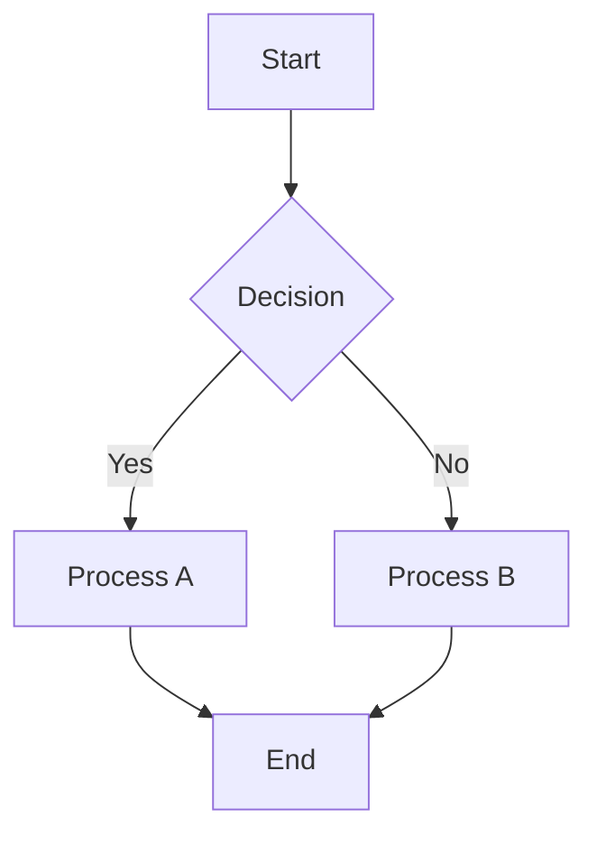
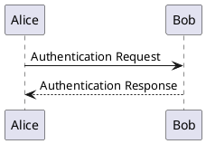
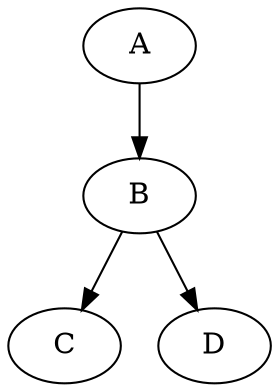
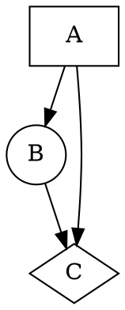

# Extended Kroki Diagram Types Test

This document demonstrates the extended diagram types supported through Kroki integration.

## Core Diagram Types (with local fallback)

### Mermaid


### PlantUML


### Vega-Lite
```vega-lite
{
  "$schema": "https://vega.github.io/schema/vega-lite/v5.json",
  "data": {"values": [{"x": 1, "y": 1}, {"x": 2, "y": 4}, {"x": 3, "y": 9}]},
  "mark": "point",
  "encoding": {
    "x": {"field": "x", "type": "quantitative"},
    "y": {"field": "y", "type": "quantitative"}
  }
}
```

## Kroki-Only Diagram Types

### Ditaa (ASCII Art Diagrams)
```ditaa
+--------+   +-------+    +-------+
|        | --+ ditaa +--> |       |
|  Text  |   +-------+    |diagram|
|Document|   |!magic!|    |       |
|     {d}|   |       |    |       |
+---+----+   +-------+    +-------+
    :                         ^
    |       Lots of work      |
    +-------------------------+
```

### GraphViz/DOT


### BlockDiag
```blockdiag
blockdiag {
  A -> B -> C;
       B -> D;
}
```

### SeqDiag (Sequence Diagrams)
```seqdiag
seqdiag {
  browser  -> webserver [label = "GET /index.html"];
  browser <-- webserver;
  browser  -> webserver [label = "POST /blog/comment"];
              webserver  -> database [label = "INSERT comment"];
              webserver <-- database;
  browser <-- webserver;
}
```

### NWDiag (Network Diagrams)
```nwdiag
nwdiag {
  network dmz {
      address = "210.x.x.x/24"

      web01 [address = "210.x.x.1"];
      web02 [address = "210.x.x.2"];
  }
  network internal {
      address = "172.x.x.x/24";

      web01 [address = "172.x.x.1"];
      web02 [address = "172.x.x.2"];
      db01;
      db02;
  }
}
```

### WaveDrom (Digital Timing Diagrams)
```wavedrom
{
  "signal": [
    {"name": "clk", "wave": "p......"},
    {"name": "dat", "wave": "x.345x.", "data": ["head", "body", "tail", "data"]},
    {"name": "req", "wave": "0.1..0."}
  ]
}
```

### Nomnoml (UML-like diagrams)
```nomnoml
[Pirate|eyeCount: Int|raid();pillage()|
  [beard]--[parrot]
  [beard]-:>[foul mouth]
]

[<abstract>Marauder]<:--[Pirate]
[Pirate]- 0..7[mischief]
[jollyness]->[Pirate]
[jollyness]->[rum]
[jollyness]->[singing]
[Pirate]-> *[rum|tastiness: Int|swig()]
[Pirate]->[singing]
[singing]<->[rum]
```

### SVGBob (ASCII to SVG)
```svgbob
       .---.
      /-o-/--
   .-/ / /->
  ( *  \/
   '-.  \
      \ /
       '
```

### C4 PlantUML (C4 Model)
```c4plantuml
@startuml C4_Elements
!include <C4/C4_Container>

Person(admin, "Administrator")
System_Boundary(c1, "Sample System") {
    Container(web_app, "Web Application", "C#, ASP.NET Core 2.1 MVC", "Allows users to compare multiple Twitter timelines")
}
System(twitter, "Twitter")

Rel(admin, web_app, "Uses", "HTTPS")
Rel(web_app, twitter, "Gets tweets from", "HTTPS")
@enduml
```

### D2 (Declarative Diagramming)
```d2
users -> network: request
network -> database
database -> network: result
network -> users: response
```

### Excalidraw (Hand-drawn style)
```excalidraw
{
  "type": "excalidraw",
  "version": 2,
  "source": "https://excalidraw.com",
  "elements": [
    {
      "id": "1",
      "type": "rectangle",
      "x": 100,
      "y": 100,
      "width": 200,
      "height": 100,
      "angle": 0,
      "strokeColor": "#000000",
      "backgroundColor": "transparent",
      "fillStyle": "hachure",
      "strokeWidth": 1,
      "roughness": 1,
      "opacity": 100
    }
  ]
}
```

### ActDiag (Activity Diagrams)
```actdiag
actdiag {
  write -> convert -> image;

  lane user {
     label = "User"
     write [label = "Write reST"];
     image [label = "Get diagram IMAGE"];
  }
  lane actdiag {
     convert [label = "Convert reST to Image"];
  }
}
```

### PacketDiag (Packet Structure)
```packetdiag
packetdiag {
  colwidth = 32
  node_height = 72

  0-15: Source Port
  16-31: Destination Port
  32-63: Sequence Number
  64-95: Acknowledgment Number
  96-99: Data Offset
  100-105: Reserved
  106: URG [rotate = 270]
  107: ACK [rotate = 270]
  108: PSH [rotate = 270]
  109: RST [rotate = 270]
  110: SYN [rotate = 270]
  111: FIN [rotate = 270]
  112-127: Window
  128-143: Checksum
  144-159: Urgent Pointer
  160-191: (Options and Padding)
  192-223: data [colheight = 3]
}
```

### RackDiag (Rack Layout)
```rackdiag
rackdiag {
  16U;
  1: UPS [2U];
  3: DB Server
  4: Web Server
  5: Web Server
  6: Web Server
  7: Load Balancer
  8: L3 Switch
  9: Firewall
  10-11: Storage
}
```

### ERD (Entity Relationship)
```erd
[Person]
*name
height
weight
+birth_date

[<label>Manager]

Person *--1 Manager
```

### Pikchr (PIC-like diagrams)
```pikchr
arrow right 200% "Markdown" "Source"
box rad 10px "Markdown" "Formatter" "(markdown.c)" fit
arrow right 200% "HTML+SVG" "Output"
arrow down 50% from last box.s
box same "Pikchr" "Formatter" "(pikchr.c)" fit
```

### Structurizr (Software Architecture)
```structurizr
workspace {
    model {
        user = person "User"
        softwareSystem = softwareSystem "Software System" {
            webApplication = container "Web Application"
            database = container "Database"
        }
        
        user -> webApplication "Uses"
        webApplication -> database "Reads from and writes to"
    }
    
    views {
        systemContext softwareSystem {
            include *
            autoLayout
        }
        
        container softwareSystem {
            include *
            autoLayout
        }
    }
}
```

### DBML (Database Markup Language)
```dbml
Table users {
  id integer [primary key]
  username varchar
  role varchar
  created_at timestamp
}

Table posts {
  id integer [primary key]
  title varchar
  body text [note: 'Content of the post']
  user_id integer
  status post_status
  created_at timestamp
}

Ref: posts.user_id > users.id // many-to-one
```

### DOT (GraphViz DOT format)


### Bytefield (Packet/Data Structure)
```bytefield
(defattrs :bg-green {:fill "#a0ffa0"})
(defattrs :bg-yellow {:fill "#ffffa0"})
(defattrs :bg-pink {:fill "#ffb0a0"})
(defattrs :bg-cyan {:fill "#a0ffff"})
(defattrs :bg-purple {:fill "#e4b5f7"})

(defn draw-group-label-header
  "Creates a small borderless box used to draw the textual label headers"
  [label]
  (draw-box label {:span 4 :borders #{} :height 14}))

(defn draw-remotedb-header
  "Generates the byte and bit labels and standard header row"
  []
  (draw-column-headers)
  (draw-group-label-header "start")
  (draw-group-label-header "TxID")
  (draw-group-label-header "type")
  (draw-group-label-header "args")
  (next-row 18))

(draw-remotedb-header)

(draw-box 0x11 :bg-green)
(draw-box 0x872349ae {:span 4} :bg-yellow)
(draw-box 0x11 :bg-pink)
(draw-box (text "0000000c" :math) {:span 4} :bg-cyan)
(draw-box 0x14 :bg-purple)
(draw-box 0x0000009c {:span 4} :bg-green)
(draw-box 0x11 :bg-pink)
(draw-box (hex-text 6 :bold) {:span 4} :bg-yellow)
```

## Additional QuickInsert Available Types

The following types are also available in the QuickInsert menu (Ctrl+Shift+7):

1. **Vega Chart** - Data visualization
2. **Flow Chart** - Flowchart.js diagrams  
3. **Sequence Diagram** - JS-Sequence diagrams
4. **PlantUML Diagram** - UML diagrams
5. **Mermaid** - Various diagram types
6. **Ditaa Diagram** - ASCII art diagrams
7. **GraphViz/DOT** - Graph layouts
8. **BlockDiag** - Block diagrams
9. **WaveDrom** - Digital timing diagrams
10. **C4 PlantUML** - C4 model diagrams
11. **D2 Diagram** - Declarative diagrams
12. **DOT/GraphViz** - DOT graph language
13. **Sequence Diag** - Sequence diagrams
14. **Activity Diag** - Activity diagrams
15. **Network Diag** - Network diagrams
16. **Packet Diag** - Packet diagrams
17. **Rack Diag** - Rack diagrams
18. **ERD Diagram** - Entity relationship diagrams
19. **Excalidraw** - Hand-drawn diagrams
20. **Nomnoml** - UML diagrams
21. **SVGBob** - ASCII to SVG diagrams
22. **Pikchr** - PIC-like diagrams
23. **Structurizr** - Software architecture
24. **DBML** - Database markup language

## Testing Instructions

### QuickInsert Menu Test
1. **Open QuickInsert**: Press `Ctrl+Shift+7` (German keyboard) or `Ctrl+/` 
2. **Navigate to Diagram Section**: Scroll to the "diagram" section
3. **Verify Count**: You should see 19+ diagram options instead of just 5
4. **Test Selection**: Click on any diagram type to insert a template

### Kroki Integration Test
1. **Enable Kroki in Settings**: Go to Preferences > Markdown > Diagrams and enable "Render diagrams via Kroki"
2. **Set Kroki Server URL**: Ensure it's set to `http://localhost:8000` (default)
3. **Test Fallback**: Disable Kroki to test local rendering for core types
4. **Test Kroki-Only**: Enable Kroki to test extended diagram types
5. **Test Error Handling**: Try unreachable Kroki server (e.g., port 8001) - should show timeout error instead of fallback

### Manual Diagram Testing
1. **Copy Examples**: Copy any diagram code block from this document
2. **Paste in MarkText**: Create new document and paste
3. **View Rendering**: Check if diagram renders correctly
4. **Test Export**: Export to HTML/PDF to verify diagram inclusion

## Expected Behavior

- **Core types** (mermaid, plantuml, vega-lite): Should work both with Kroki enabled and disabled
- **Kroki-only types**: Should only work when Kroki is enabled, show proper error message when disabled  
- **QuickInsert Menu**: Should show 19+ diagram options in the diagram section
- **Error Handling**: When Kroki server unreachable, should show timeout error (not silent fallback)
- **Export**: All diagram types should work in HTML export when Kroki is enabled

## Troubleshooting

- **QuickInsert shows only 5 diagrams**: Restart MarkText completely (close and reopen)
- **Kroki diagrams not rendering**: Check Kroki server URL in preferences
- **Timeout errors**: Verify Kroki server is running and accessible
- **Fallback not working**: Check if diagram type supports local rendering (core types only)
