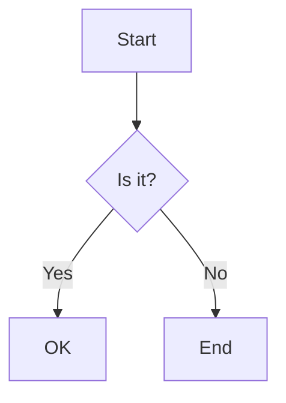
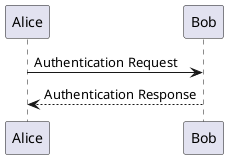
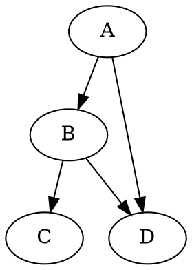

# Kroki All Diagram Types Test

This document contains simple examples for all 29 supported Kroki diagram types.

https://kroki.io/examples.html


## Mermaid


## PlantUML


## Vega-Lite
```vega-lite
{
  "$schema": "https://vega.github.io/schema/vega-lite/v5.json",
  "data": {"values": [{"a": "A", "b": 28}, {"a": "B", "b": 55}, {"a": "C", "b": 43}]},
  "mark": "bar",
  "encoding": {
    "x": {"field": "a", "type": "ordinal"},
    "y": {"field": "b", "type": "quantitative"}
  }
}
```

## Flowchart (via GraphViz)
```flowchart
digraph G {
  node [fontname = "Handlee"];
  edge [fontname = "Handlee"];

  draw [
    label = "Draw a picture";
    shape = rect;
  ];
  win [
    label = "You win!";
    shape = oval;
  ];
  guess [
    label = "Did they\nguess it?";
    shape = diamond;
  ];
  point [
    label = "Point repeatedly\nto the same picture.";
    shape = rect;
  ];

  draw -> guess;
  guess -> win [ label = "Yes" ];
  point -> guess;
  guess -> point [ label = "No" ];
  {
    rank=same;
    guess; point; win;
  }
}
```

## Sequence (via SeqDiag)
```sequence
Alice->Bob: Hello Bob, how are you?
Note right of Bob: Bob thinks
Bob-->Alice: I am good thanks!
```

## GraphViz


## BlockDiag
```blockdiag
blockdiag {
    A -> B -> C;
    B -> D;
}
```

## SeqDiag
```seqdiag
seqdiag {
    browser  -> webserver [label = "GET /"];
    webserver -> database [label = "SELECT"];
    database --> webserver;
    webserver --> browser [label = "HTML"];
}
```

## ActDiag
```actdiag
actdiag {
    write -> convert -> commit
    
    lane user {
        label = "User"
        write [label = "Write"];
        read [label = "Read"];
    }
    lane app {
        label = "Application"
        convert [label = "Convert"];
        commit [label = "Save"];
    }
}
```

## NwDiag
```nwdiag
nwdiag {
    network dmz {
        address = "210.x.x.x/24"
        web01 [address = "210.x.x.1"];
        web02 [address = "210.x.x.2"];
    }
    network internal {
        address = "172.x.x.x/24";
        web01 [address = "172.x.x.1"];
        web02 [address = "172.x.x.2"];
        db01;
    }
}
```

## PacketDiag
```packetdiag
packetdiag {
    colwidth = 32
    node_height = 72

    0-15: Source Port
    16-31: Destination Port
    32-63: Sequence Number
}
```

## RackDiag
```rackdiag
rackdiag {
    // define height of rack
    16U;

    // define rack items
    1: UPS [2U];
    3: DB Server
    4: Web Server
    5: Web Server
}
```

## BPMN
```bpmn
<?xml version="1.0" encoding="UTF-8"?>
<semantic:definitions xmlns:xsi="http://www.w3.org/2001/XMLSchema-instance" xmlns:di="http://www.omg.org/spec/DD/20100524/DI" xmlns:bpmndi="http://www.omg.org/spec/BPMN/20100524/DI" xmlns:dc="http://www.omg.org/spec/DD/20100524/DC" xmlns:semantic="http://www.omg.org/spec/BPMN/20100524/MODEL" id="_1275940932088" targetNamespace="http://www.trisotech.com/definitions/_1275940932088" exporter="Camunda Modeler" exporterVersion="1.16.0">
  <semantic:message id="_1275940932310" />
  <semantic:message id="_1275940932433" />
  <semantic:process id="_6-1" isExecutable="false">
    <semantic:laneSet id="ls_6-438">
      <semantic:lane id="_6-650" name="clerk">
        <semantic:flowNodeRef>OrderReceivedEvent</semantic:flowNodeRef>
        <semantic:flowNodeRef>_6-652</semantic:flowNodeRef>
        <semantic:flowNodeRef>_6-674</semantic:flowNodeRef>
        <semantic:flowNodeRef>CalmCustomerTask</semantic:flowNodeRef>
      </semantic:lane>
      <semantic:lane id="_6-446" name="pizza chef">
        <semantic:flowNodeRef>_6-463</semantic:flowNodeRef>
      </semantic:lane>
      <semantic:lane id="_6-448" name="delivery boy">
        <semantic:flowNodeRef>_6-514</semantic:flowNodeRef>
        <semantic:flowNodeRef>_6-565</semantic:flowNodeRef>
        <semantic:flowNodeRef>_6-616</semantic:flowNodeRef>
      </semantic:lane>
    </semantic:laneSet>
    <semantic:startEvent id="OrderReceivedEvent" name="Order received">
      <semantic:outgoing>_6-630</semantic:outgoing>
      <semantic:messageEventDefinition messageRef="_1275940932310" />
    </semantic:startEvent>
    <semantic:parallelGateway id="_6-652" name="">
      <semantic:incoming>_6-630</semantic:incoming>
      <semantic:outgoing>_6-691</semantic:outgoing>
      <semantic:outgoing>_6-693</semantic:outgoing>
    </semantic:parallelGateway>
    <semantic:intermediateCatchEvent id="_6-674" name="„where is my pizza?“">
      <semantic:incoming>_6-691</semantic:incoming>
      <semantic:incoming>_6-746</semantic:incoming>
      <semantic:outgoing>_6-748</semantic:outgoing>
      <semantic:messageEventDefinition messageRef="_1275940932433" />
    </semantic:intermediateCatchEvent>
    <semantic:task id="CalmCustomerTask" name="Calm customer">
      <semantic:incoming>_6-748</semantic:incoming>
      <semantic:outgoing>_6-746</semantic:outgoing>
    </semantic:task>
    <semantic:task id="_6-463" name="Bake the pizza">
      <semantic:incoming>_6-693</semantic:incoming>
      <semantic:outgoing>_6-632</semantic:outgoing>
    </semantic:task>
    <semantic:task id="_6-514" name="Deliver the pizza">
      <semantic:incoming>_6-632</semantic:incoming>
      <semantic:outgoing>_6-634</semantic:outgoing>
    </semantic:task>
    <semantic:task id="_6-565" name="Receive payment">
      <semantic:incoming>_6-634</semantic:incoming>
      <semantic:outgoing>_6-636</semantic:outgoing>
    </semantic:task>
    <semantic:endEvent id="_6-616" name="">
      <semantic:incoming>_6-636</semantic:incoming>
      <semantic:terminateEventDefinition />
    </semantic:endEvent>
    <semantic:sequenceFlow id="_6-630" name="" sourceRef="OrderReceivedEvent" targetRef="_6-652" />
    <semantic:sequenceFlow id="_6-632" name="" sourceRef="_6-463" targetRef="_6-514" />
    <semantic:sequenceFlow id="_6-634" name="" sourceRef="_6-514" targetRef="_6-565" />
    <semantic:sequenceFlow id="_6-636" name="" sourceRef="_6-565" targetRef="_6-616" />
    <semantic:sequenceFlow id="_6-691" name="" sourceRef="_6-652" targetRef="_6-674" />
    <semantic:sequenceFlow id="_6-693" name="" sourceRef="_6-652" targetRef="_6-463" />
    <semantic:sequenceFlow id="_6-746" name="" sourceRef="CalmCustomerTask" targetRef="_6-674" />
    <semantic:sequenceFlow id="_6-748" name="" sourceRef="_6-674" targetRef="CalmCustomerTask" />
  </semantic:process>
  <semantic:message id="_1275940932198" />
  <semantic:process id="_6-2" isExecutable="false">
    <semantic:startEvent id="_6-61" name="Hungry for pizza">
      <semantic:outgoing>_6-125</semantic:outgoing>
    </semantic:startEvent>
    <semantic:task id="SelectAPizzaTask" name="Select a pizza">
      <semantic:incoming>_6-125</semantic:incoming>
      <semantic:outgoing>_6-178</semantic:outgoing>
    </semantic:task>
    <semantic:task id="_6-127" name="Order a pizza">
      <semantic:incoming>_6-178</semantic:incoming>
      <semantic:outgoing>_6-420</semantic:outgoing>
    </semantic:task>
    <semantic:eventBasedGateway id="_6-180" name="">
      <semantic:incoming>_6-420</semantic:incoming>
      <semantic:incoming>_6-430</semantic:incoming>
      <semantic:outgoing>_6-422</semantic:outgoing>
      <semantic:outgoing>_6-424</semantic:outgoing>
    </semantic:eventBasedGateway>
    <semantic:intermediateCatchEvent id="_6-202" name="pizza received">
      <semantic:incoming>_6-422</semantic:incoming>
      <semantic:outgoing>_6-428</semantic:outgoing>
      <semantic:messageEventDefinition messageRef="_1275940932198" />
    </semantic:intermediateCatchEvent>
    <semantic:intermediateCatchEvent id="_6-219" name="60 minutes">
      <semantic:incoming>_6-424</semantic:incoming>
      <semantic:outgoing>_6-426</semantic:outgoing>
      <semantic:timerEventDefinition>
        <semantic:timeDate />
      </semantic:timerEventDefinition>
    </semantic:intermediateCatchEvent>
    <semantic:task id="_6-236" name="Ask for the pizza">
      <semantic:incoming>_6-426</semantic:incoming>
      <semantic:outgoing>_6-430</semantic:outgoing>
    </semantic:task>
    <semantic:task id="_6-304" name="Pay the pizza">
      <semantic:incoming>_6-428</semantic:incoming>
      <semantic:outgoing>_6-434</semantic:outgoing>
    </semantic:task>
    <semantic:task id="_6-355" name="Eat the pizza">
      <semantic:incoming>_6-434</semantic:incoming>
      <semantic:outgoing>_6-436</semantic:outgoing>
    </semantic:task>
    <semantic:endEvent id="_6-406" name="Hunger satisfied">
      <semantic:incoming>_6-436</semantic:incoming>
    </semantic:endEvent>
    <semantic:sequenceFlow id="_6-125" name="" sourceRef="_6-61" targetRef="SelectAPizzaTask" />
    <semantic:sequenceFlow id="_6-178" name="" sourceRef="SelectAPizzaTask" targetRef="_6-127" />
    <semantic:sequenceFlow id="_6-420" name="" sourceRef="_6-127" targetRef="_6-180" />
    <semantic:sequenceFlow id="_6-422" name="" sourceRef="_6-180" targetRef="_6-202" />
    <semantic:sequenceFlow id="_6-424" name="" sourceRef="_6-180" targetRef="_6-219" />
    <semantic:sequenceFlow id="_6-426" name="" sourceRef="_6-219" targetRef="_6-236" />
    <semantic:sequenceFlow id="_6-428" name="" sourceRef="_6-202" targetRef="_6-304" />
    <semantic:sequenceFlow id="_6-430" name="" sourceRef="_6-236" targetRef="_6-180" />
    <semantic:sequenceFlow id="_6-434" name="" sourceRef="_6-304" targetRef="_6-355" />
    <semantic:sequenceFlow id="_6-436" name="" sourceRef="_6-355" targetRef="_6-406" />
  </semantic:process>
  <semantic:collaboration id="C1275940932557">
    <semantic:participant id="_6-53" name="Pizza Customer" processRef="_6-2" />
    <semantic:participant id="_6-438" name="Pizza vendor" processRef="_6-1" />
    <semantic:messageFlow id="_6-638" name="pizza order" sourceRef="_6-127" targetRef="OrderReceivedEvent" />
    <semantic:messageFlow id="_6-642" name="" sourceRef="_6-236" targetRef="_6-674" />
    <semantic:messageFlow id="_6-646" name="receipt" sourceRef="_6-565" targetRef="_6-304" />
    <semantic:messageFlow id="_6-648" name="money" sourceRef="_6-304" targetRef="_6-565" />
    <semantic:messageFlow id="_6-640" name="pizza" sourceRef="_6-514" targetRef="_6-202" />
    <semantic:messageFlow id="_6-750" name="" sourceRef="CalmCustomerTask" targetRef="_6-236" />
  </semantic:collaboration>
  <bpmndi:BPMNDiagram id="Trisotech.Visio-_6" name="Untitled Diagram" documentation="" resolution="96.00000267028808">
    <bpmndi:BPMNPlane bpmnElement="C1275940932557">
      <bpmndi:BPMNShape id="Trisotech.Visio__6-53" bpmnElement="_6-53" isHorizontal="true">
        <dc:Bounds x="12" y="12" width="1044" height="294" />
        <bpmndi:BPMNLabel />
      </bpmndi:BPMNShape>
      <bpmndi:BPMNShape id="Trisotech.Visio__6-438" bpmnElement="_6-438" isHorizontal="true">
        <dc:Bounds x="12" y="372" width="905" height="337" />
        <bpmndi:BPMNLabel />
      </bpmndi:BPMNShape>
      <bpmndi:BPMNShape id="Trisotech.Visio__6__6-650" bpmnElement="_6-650" isHorizontal="true">
        <dc:Bounds x="42" y="372" width="875" height="114" />
        <bpmndi:BPMNLabel />
      </bpmndi:BPMNShape>
      <bpmndi:BPMNShape id="Trisotech.Visio__6__6-446" bpmnElement="_6-446" isHorizontal="true">
        <dc:Bounds x="42" y="486" width="875" height="114" />
        <bpmndi:BPMNLabel />
      </bpmndi:BPMNShape>
      <bpmndi:BPMNShape id="Trisotech.Visio__6__6-448" bpmnElement="_6-448" isHorizontal="true">
        <dc:Bounds x="42" y="600" width="875" height="109" />
        <bpmndi:BPMNLabel />
      </bpmndi:BPMNShape>
      <bpmndi:BPMNShape id="Trisotech.Visio__6_OrderReceivedEvent" bpmnElement="OrderReceivedEvent">
        <dc:Bounds x="79" y="405" width="30" height="30" />
        <bpmndi:BPMNLabel />
      </bpmndi:BPMNShape>
      <bpmndi:BPMNShape id="Trisotech.Visio__6__6-652" bpmnElement="_6-652">
        <dc:Bounds x="140" y="399" width="42" height="42" />
        <bpmndi:BPMNLabel />
      </bpmndi:BPMNShape>
      <bpmndi:BPMNShape id="Trisotech.Visio__6__6-674" bpmnElement="_6-674">
        <dc:Bounds x="218" y="404" width="32" height="32" />
        <bpmndi:BPMNLabel />
      </bpmndi:BPMNShape>
      <bpmndi:BPMNShape id="Trisotech.Visio__6_CalmCustomerTask" bpmnElement="CalmCustomerTask">
        <dc:Bounds x="286" y="386" width="83" height="68" />
        <bpmndi:BPMNLabel />
      </bpmndi:BPMNShape>
      <bpmndi:BPMNShape id="Trisotech.Visio__6__6-463" bpmnElement="_6-463">
        <dc:Bounds x="252" y="521" width="83" height="68" />
        <bpmndi:BPMNLabel />
      </bpmndi:BPMNShape>
      <bpmndi:BPMNShape id="Trisotech.Visio__6__6-514" bpmnElement="_6-514">
        <dc:Bounds x="464" y="629" width="83" height="68" />
        <bpmndi:BPMNLabel />
      </bpmndi:BPMNShape>
      <bpmndi:BPMNShape id="Trisotech.Visio__6__6-565" bpmnElement="_6-565">
        <dc:Bounds x="603" y="629" width="83" height="68" />
        <bpmndi:BPMNLabel />
      </bpmndi:BPMNShape>
      <bpmndi:BPMNShape id="Trisotech.Visio__6__6-616" bpmnElement="_6-616">
        <dc:Bounds x="722" y="647" width="32" height="32" />
        <bpmndi:BPMNLabel />
      </bpmndi:BPMNShape>
      <bpmndi:BPMNShape id="Trisotech.Visio__6__6-61" bpmnElement="_6-61">
        <dc:Bounds x="66" y="96" width="30" height="30" />
        <bpmndi:BPMNLabel />
      </bpmndi:BPMNShape>
      <bpmndi:BPMNShape id="Trisotech.Visio__6__6-74" bpmnElement="SelectAPizzaTask">
        <dc:Bounds x="145" y="77" width="83" height="68" />
        <bpmndi:BPMNLabel />
      </bpmndi:BPMNShape>
      <bpmndi:BPMNShape id="Trisotech.Visio__6__6-127" bpmnElement="_6-127">
        <dc:Bounds x="265" y="77" width="83" height="68" />
        <bpmndi:BPMNLabel />
      </bpmndi:BPMNShape>
      <bpmndi:BPMNShape id="Trisotech.Visio__6__6-180" bpmnElement="_6-180">
        <dc:Bounds x="378" y="90" width="42" height="42" />
        <bpmndi:BPMNLabel />
      </bpmndi:BPMNShape>
      <bpmndi:BPMNShape id="Trisotech.Visio__6__6-202" bpmnElement="_6-202">
        <dc:Bounds x="647" y="95" width="32" height="32" />
        <bpmndi:BPMNLabel />
      </bpmndi:BPMNShape>
      <bpmndi:BPMNShape id="Trisotech.Visio__6__6-219" bpmnElement="_6-219">
        <dc:Bounds x="448" y="184" width="32" height="32" />
        <bpmndi:BPMNLabel />
      </bpmndi:BPMNShape>
      <bpmndi:BPMNShape id="Trisotech.Visio__6__6-236" bpmnElement="_6-236">
        <dc:Bounds x="517" y="166" width="83" height="68" />
        <bpmndi:BPMNLabel />
      </bpmndi:BPMNShape>
      <bpmndi:BPMNShape id="Trisotech.Visio__6__6-304" bpmnElement="_6-304">
        <dc:Bounds x="726" y="77" width="83" height="68" />
        <bpmndi:BPMNLabel />
      </bpmndi:BPMNShape>
      <bpmndi:BPMNShape id="Trisotech.Visio__6__6-355" bpmnElement="_6-355">
        <dc:Bounds x="834" y="77" width="83" height="68" />
        <bpmndi:BPMNLabel />
      </bpmndi:BPMNShape>
      <bpmndi:BPMNShape id="Trisotech.Visio__6__6-406" bpmnElement="_6-406">
        <dc:Bounds x="956" y="95" width="32" height="32" />
        <bpmndi:BPMNLabel />
      </bpmndi:BPMNShape>
      <bpmndi:BPMNEdge id="Trisotech.Visio__6__6-640" bpmnElement="_6-640">
        <di:waypoint x="506" y="629" />
        <di:waypoint x="506" y="384" />
        <di:waypoint x="663" y="384" />
        <di:waypoint x="663" y="127" />
        <bpmndi:BPMNLabel />
      </bpmndi:BPMNEdge>
      <bpmndi:BPMNEdge id="Trisotech.Visio__6__6-630" bpmnElement="_6-630">
        <di:waypoint x="109" y="420" />
        <di:waypoint x="140" y="420" />
        <bpmndi:BPMNLabel />
      </bpmndi:BPMNEdge>
      <bpmndi:BPMNEdge id="Trisotech.Visio__6__6-691" bpmnElement="_6-691">
        <di:waypoint x="182" y="420" />
        <di:waypoint x="200" y="420" />
        <di:waypoint x="218" y="420" />
        <bpmndi:BPMNLabel />
      </bpmndi:BPMNEdge>
      <bpmndi:BPMNEdge id="Trisotech.Visio__6__6-648" bpmnElement="_6-648">
        <di:waypoint x="754" y="145" />
        <di:waypoint x="754" y="408" />
        <di:waypoint x="630" y="408" />
        <di:waypoint x="631" y="629" />
        <bpmndi:BPMNLabel />
      </bpmndi:BPMNEdge>
      <bpmndi:BPMNEdge id="Trisotech.Visio__6__6-422" bpmnElement="_6-422">
        <di:waypoint x="420" y="111" />
        <di:waypoint x="438" y="111" />
        <di:waypoint x="647" y="111" />
        <bpmndi:BPMNLabel />
      </bpmndi:BPMNEdge>
      <bpmndi:BPMNEdge id="Trisotech.Visio__6__6-646" bpmnElement="_6-646" messageVisibleKind="non_initiating">
        <di:waypoint x="658" y="629" />
        <di:waypoint x="658" y="432" />
        <di:waypoint x="782" y="432" />
        <di:waypoint x="782" y="145" />
        <bpmndi:BPMNLabel />
      </bpmndi:BPMNEdge>
      <bpmndi:BPMNEdge id="Trisotech.Visio__6__6-428" bpmnElement="_6-428">
        <di:waypoint x="679" y="111" />
        <di:waypoint x="726" y="111" />
        <bpmndi:BPMNLabel />
      </bpmndi:BPMNEdge>
      <bpmndi:BPMNEdge id="Trisotech.Visio__6__6-748" bpmnElement="_6-748">
        <di:waypoint x="250" y="420" />
        <di:waypoint x="268" y="420" />
        <di:waypoint x="286" y="420" />
        <bpmndi:BPMNLabel />
      </bpmndi:BPMNEdge>
      <bpmndi:BPMNEdge id="Trisotech.Visio__6__6-420" bpmnElement="_6-420">
        <di:waypoint x="348" y="111" />
        <di:waypoint x="366" y="111" />
        <di:waypoint x="378" y="111" />
        <bpmndi:BPMNLabel />
      </bpmndi:BPMNEdge>
      <bpmndi:BPMNEdge id="Trisotech.Visio__6__6-636" bpmnElement="_6-636">
        <di:waypoint x="686" y="663" />
        <di:waypoint x="704" y="663" />
        <di:waypoint x="722" y="663" />
        <bpmndi:BPMNLabel />
      </bpmndi:BPMNEdge>
      <bpmndi:BPMNEdge id="Trisotech.Visio__6__6-750" bpmnElement="_6-750">
        <di:waypoint x="328" y="386" />
        <di:waypoint x="328" y="348" />
        <di:waypoint x="572" y="348" />
        <di:waypoint x="572" y="234" />
        <bpmndi:BPMNLabel />
      </bpmndi:BPMNEdge>
      <bpmndi:BPMNEdge id="Trisotech.Visio__6__6-436" bpmnElement="_6-436">
        <di:waypoint x="918" y="111" />
        <di:waypoint x="936" y="111" />
        <di:waypoint x="956" y="111" />
        <bpmndi:BPMNLabel />
      </bpmndi:BPMNEdge>
      <bpmndi:BPMNEdge id="Trisotech.Visio__6__6-632" bpmnElement="_6-632">
        <di:waypoint x="335" y="555" />
        <di:waypoint x="353" y="555" />
        <di:waypoint x="353" y="663" />
        <di:waypoint x="464" y="663" />
        <bpmndi:BPMNLabel />
      </bpmndi:BPMNEdge>
      <bpmndi:BPMNEdge id="Trisotech.Visio__6__6-634" bpmnElement="_6-634">
        <di:waypoint x="548" y="663" />
        <di:waypoint x="603" y="663" />
        <bpmndi:BPMNLabel />
      </bpmndi:BPMNEdge>
      <bpmndi:BPMNEdge id="Trisotech.Visio__6__6-125" bpmnElement="_6-125">
        <di:waypoint x="96" y="111" />
        <di:waypoint x="114" y="111" />
        <di:waypoint x="145" y="111" />
        <bpmndi:BPMNLabel />
      </bpmndi:BPMNEdge>
      <bpmndi:BPMNEdge id="Trisotech.Visio__6__6-430" bpmnElement="_6-430">
        <di:waypoint x="600" y="200" />
        <di:waypoint x="618" y="200" />
        <di:waypoint x="618" y="252" />
        <di:waypoint x="576" y="252" />
        <di:waypoint x="549" y="252" />
        <di:waypoint x="360" y="252" />
        <di:waypoint x="360" y="111" />
        <di:waypoint x="378" y="111" />
        <bpmndi:BPMNLabel />
      </bpmndi:BPMNEdge>
      <bpmndi:BPMNEdge id="Trisotech.Visio__6__6-642" bpmnElement="_6-642">
        <di:waypoint x="545" y="234" />
        <di:waypoint x="545" y="324" />
        <di:waypoint x="234" y="324" />
        <di:waypoint x="234" y="404" />
        <bpmndi:BPMNLabel />
      </bpmndi:BPMNEdge>
      <bpmndi:BPMNEdge id="Trisotech.Visio__6__6-424" bpmnElement="_6-424">
        <di:waypoint x="399" y="132" />
        <di:waypoint x="399" y="200" />
        <di:waypoint x="448" y="200" />
        <bpmndi:BPMNLabel />
      </bpmndi:BPMNEdge>
      <bpmndi:BPMNEdge id="Trisotech.Visio__6__6-638" bpmnElement="_6-638">
        <di:waypoint x="306" y="145" />
        <di:waypoint x="306" y="252" />
        <di:waypoint x="94" y="252" />
        <di:waypoint x="94" y="405" />
        <bpmndi:BPMNLabel />
      </bpmndi:BPMNEdge>
      <bpmndi:BPMNEdge id="Trisotech.Visio__6__6-426" bpmnElement="_6-426">
        <di:waypoint x="480" y="200" />
        <di:waypoint x="498" y="200" />
        <di:waypoint x="517" y="200" />
        <bpmndi:BPMNLabel />
      </bpmndi:BPMNEdge>
      <bpmndi:BPMNEdge id="Trisotech.Visio__6__6-693" bpmnElement="_6-693">
        <di:waypoint x="161" y="441" />
        <di:waypoint x="161" y="556" />
        <di:waypoint x="252" y="555" />
        <bpmndi:BPMNLabel />
      </bpmndi:BPMNEdge>
      <bpmndi:BPMNEdge id="Trisotech.Visio__6__6-178" bpmnElement="_6-178">
        <di:waypoint x="228" y="111" />
        <di:waypoint x="265" y="111" />
        <bpmndi:BPMNLabel />
      </bpmndi:BPMNEdge>
      <bpmndi:BPMNEdge id="Trisotech.Visio__6__6-746" bpmnElement="_6-746">
        <di:waypoint x="370" y="420" />
        <di:waypoint x="386" y="420" />
        <di:waypoint x="386" y="474" />
        <di:waypoint x="191" y="474" />
        <di:waypoint x="191" y="420" />
        <di:waypoint x="218" y="420" />
        <bpmndi:BPMNLabel />
      </bpmndi:BPMNEdge>
      <bpmndi:BPMNEdge id="Trisotech.Visio__6__6-434" bpmnElement="_6-434">
        <di:waypoint x="810" y="111" />
        <di:waypoint x="834" y="111" />
        <bpmndi:BPMNLabel />
      </bpmndi:BPMNEdge>
    </bpmndi:BPMNPlane>
  </bpmndi:BPMNDiagram>
</semantic:definitions>
```

## C4PlantUML
```c4plantuml
@startuml
!include C4_Context.puml

title System Context diagram

Person(customer, "Customer", "A customer")
System(banking_system, "Banking System", "Allows customers to view account info")

Rel(customer, banking_system, "Views account balances")
@enduml
```

## Structurizr
```structurizr
workspace {
    model {
        user = person "User"
        softwareSystem = softwareSystem "Software System"
        user -> softwareSystem "Uses"
    }
    views {
        systemContext softwareSystem {
            include *
            autoLayout
        }
    }
}
```

## Nomnoml
```nomnoml
[<frame>Diagram|
  [<abstract>Shape]<:--[Rectangle]
  [Shape]<:--[Ellipse]
  [Rectangle]-[Square]
]
```

## DBML
```dbml
Table users {
  id integer [primary key]
  username varchar
  role varchar
  created_at timestamp
}

Table posts {
  id integer [primary key]
  title varchar
  body text [note: 'Content of the post']
  user_id integer
  created_at timestamp
}

Ref: posts.user_id > users.id
```

## ERD
```erd
# Entities

[Person]
*name
height
weight
birth_date

[City]
*name
state
country

# Relationships

Person *--1 City
```

## Bytefield
```bytefield
(defattrs :bg-green {:fill "#a0ffa0"})
(defattrs :bg-yellow {:fill "#ffffa0"})
(defattrs :bg-pink {:fill "#ffb0a0"})
(defattrs :bg-cyan {:fill "#a0fafa"})
(defattrs :bg-purple {:fill "#e4b5f7"})

(defn draw-group-label-header
  "Creates a small borderless box used to draw the textual label headers
  used below the byte labels for remotedb message diagrams.
  Arguments are the number of columns to span and the text of the
  label."
  [span label]
  (draw-box (text label [:math {:font-size 12}]) {:span    span
                                                  :borders #{}
                                                  :height  14}))

(defn draw-remotedb-header
  "Generates the byte and field labels and standard header fields of a
  request or response message for the remotedb database server with
  the specified kind and args values."
  [kind args]
  (draw-column-headers)
  (draw-group-label-header 5 "start")
  (draw-group-label-header 5 "TxID")
  (draw-group-label-header 3 "type")
  (draw-group-label-header 2 "args")
  (draw-group-label-header 1 "tags")
  (next-row 18)

  (draw-box 0x11 :bg-green)
  (draw-box 0x872349ae [{:span 4} :bg-green])
  (draw-box 0x11 :bg-yellow)
  (draw-box (text "TxID" :math) [{:span 4} :bg-yellow])
  (draw-box 0x10 :bg-pink)
  (draw-box (hex-text kind 4 :bold) [{:span 2} :bg-pink])
  (draw-box 0x0f :bg-cyan)
  (draw-box (hex-text args 2 :bold) :bg-cyan)
  (draw-box 0x14 :bg-purple)

  (draw-box (text "0000000c" :hex [[:plain {:font-weight "light" :font-size 16}] " (12)"])
            [{:span 4} :bg-purple])
  (draw-box (hex-text 6 2 :bold) [:box-first :bg-purple])
  (doseq [val [6 6 3 6 6 6 6 3]]
    (draw-box (hex-text val 2 :bold) [:box-related :bg-purple]))
  (doseq [val [0 0]]
    (draw-box val [:box-related :bg-purple]))
  (draw-box 0 [:box-last :bg-purple]))

(draw-remotedb-header 0x4702 9)

(draw-box 0x11)
(draw-box 0x2104 {:span 4})
(draw-box 0x11)
(draw-box 0 {:span 4})
(draw-box 0x11)
(draw-box (text "length" [:math] [:sub 1]) {:span 4})
(draw-box 0x14)

(draw-box (text "length" [:math] [:sub 1]) {:span 4})
(draw-gap "Cue and loop point bytes")

(draw-box nil :box-below)
(draw-box 0x11)
(draw-box 0x36 {:span 4})
(draw-box 0x11)
(draw-box (text "num" [:math] [:sub "hot"]) {:span 4})
(draw-box 0x11)
(draw-box (text "num" [:math] [:sub "cue"]) {:span 4})

(draw-box 0x11)
(draw-box (text "length" [:math] [:sub 2]) {:span 4})
(draw-box 0x14)
(draw-box (text "length" [:math] [:sub 2]) {:span 4})
(draw-gap "Unknown bytes" {:min-label-columns 6})
(draw-bottom)
```

## Ditaa
```ditaa
+--------+   +-------+    +-------+
|        | --+ ditaa +--> |       |
|  Text  |   +-------+    |diagram|
|Document|   |!magic!|    |       |
|     {d}|   |       |    |       |
+---+----+   +-------+    +-------+
    :                         ^
    |       Lots of work      |
    +-------------------------+
```

## Pikchr
```pikchr
arrow right 200% "Markdown" "Source"
box rad 10px "Kroki" fit
arrow right 200% "SVG" "Image"
```

## SvgBob
```svgbob
       .---.
      /-o-/--
   .-/ / /->
  ( *  \/
   '-.  \
      \ /
       '
```

## WaveDrom
```wavedrom
{
  "signal": [
    {"name": "clk", "wave": "P......"},
    {"name": "bus", "wave": "x.==.=x", "data": ["head", "body", "tail", "data"]},
    {"name": "wire", "wave": "0.1..0."}
  ]
}
```

## WireViz
```wireviz
connectors:
  X1:
    type: D-Sub
    subtype: female
    pincount: 9

  X2:
    type: Molex KK 254
    subtype: female
    pincount: 3

cables:
  W1:
    gauge: 0.25 mm2
    length: 0.2
    color_code: DIN
    wirecount: 3
    shield: true

connections:
  -
    - X1: [2,3,5]
    - W1: [1,2,3]
    - X2: [1,2,3]
```

## Symbolator
```symbolator
library ieee;
use ieee.std_logic_1164.all;

entity counter is
  port (
    clk : in std_logic;
    rst : in std_logic;
    count : out std_logic_vector(7 downto 0)
  );
end entity;
```

## Vega
```vega
{
  "$schema": "https://vega.github.io/schema/vega/v5.json",
  "width": 400,
  "height": 200,
  "padding": 5,
  "data": [
    {"name": "table", "values": [{"x": 1, "y": 28}, {"x": 2, "y": 55}, {"x": 3, "y": 43}]}
  ],
  "scales": [
    {"name": "x", "type": "linear", "range": "width", "domain": {"data": "table", "field": "x"}},
    {"name": "y", "type": "linear", "range": "height", "domain": {"data": "table", "field": "y"}}
  ],
  "marks": [
    {
      "type": "rect",
      "from": {"data": "table"},
      "encode": {
        "enter": {
          "x": {"scale": "x", "field": "x"},
          "width": {"value": 50},
          "y": {"scale": "y", "field": "y", "offset": -2},
          "height": {"scale": "y", "band": 1, "offset": 2}
        }
      }
    }
  ]
}
```

## Excalidraw
```excalidraw
{
  "type": "excalidraw",
  "version": 2,
  "source": "https://excalidraw.com",
  "elements": [
    {
      "type": "rectangle",
      "version": 175,
      "versionNonce": 279344008,
      "isDeleted": false,
      "id": "2ZYh24ed28FJ0yE-S3YNY",
      "fillStyle": "hachure",
      "strokeWidth": 1,
      "strokeStyle": "solid",
      "roughness": 1,
      "opacity": 100,
      "angle": 0,
      "x": 580,
      "y": 140,
      "strokeColor": "#000000",
      "backgroundColor": "#15aabf",
      "width": 80,
      "height": 19.999999999999996,
      "seed": 521916552,
      "groupIds": [],
      "strokeSharpness": "sharp",
      "boundElementIds": [
        "Be1y2yzhV3Zd4nwCro__8"
      ]
    },
    {
      "type": "rectangle",
      "version": 180,
      "versionNonce": 164784376,
      "isDeleted": false,
      "id": "bO0OVt6m7LowYpq22ePCA",
      "fillStyle": "hachure",
      "strokeWidth": 1,
      "strokeStyle": "solid",
      "roughness": 1,
      "opacity": 100,
      "angle": 0,
      "x": 660,
      "y": 140,
      "strokeColor": "#000000",
      "backgroundColor": "#4c6ef5",
      "width": 120,
      "height": 19.999999999999996,
      "seed": 1303206904,
      "groupIds": [],
      "strokeSharpness": "sharp",
      "boundElementIds": [
        "KaCO9-QjUenSyCuuanoTo"
      ]
    },
    {
      "type": "rectangle",
      "version": 183,
      "versionNonce": 27181704,
      "isDeleted": false,
      "id": "jz0Huq9-s6pNxDw0RqHcR",
      "fillStyle": "hachure",
      "strokeWidth": 1,
      "strokeStyle": "solid",
      "roughness": 1,
      "opacity": 100,
      "angle": 0,
      "x": 780,
      "y": 140,
      "strokeColor": "#000000",
      "backgroundColor": "#fab005",
      "width": 180,
      "height": 19.999999999999996,
      "seed": 861962120,
      "groupIds": [],
      "strokeSharpness": "sharp",
      "boundElementIds": [
        "74ifmqmu0vN0NK0_0FwPm"
      ]
    },
    {
      "type": "rectangle",
      "version": 192,
      "versionNonce": 2123008504,
      "isDeleted": false,
      "id": "UnmNTmwJtm6moubcGtSgB",
      "fillStyle": "hachure",
      "strokeWidth": 1,
      "strokeStyle": "solid",
      "roughness": 1,
      "opacity": 100,
      "angle": 0,
      "x": 960,
      "y": 140,
      "strokeColor": "#000000",
      "backgroundColor": "#fa5252",
      "width": 80,
      "height": 19.999999999999996,
      "seed": 277814520,
      "groupIds": [],
      "strokeSharpness": "sharp",
      "boundElementIds": [
        "1v60NED2criGG-wo9-oQL"
      ]
    },
    {
      "type": "rectangle",
      "version": 202,
      "versionNonce": 1823814024,
      "isDeleted": false,
      "id": "of76J4WOJHnHi0L61Vst_",
      "fillStyle": "hachure",
      "strokeWidth": 1,
      "strokeStyle": "solid",
      "roughness": 1,
      "opacity": 100,
      "angle": 0,
      "x": 1040,
      "y": 140,
      "strokeColor": "#000000",
      "backgroundColor": "#be4bdb",
      "width": 180,
      "height": 19.999999999999996,
      "seed": 1496796808,
      "groupIds": [],
      "strokeSharpness": "sharp",
      "boundElementIds": [
        "jjuPzyRneMv3f65lps_6a"
      ]
    },
    {
      "type": "rectangle",
      "version": 193,
      "versionNonce": 1234602744,
      "isDeleted": false,
      "id": "SlvbjeV-9lXbcrlKib-hj",
      "fillStyle": "hachure",
      "strokeWidth": 1,
      "strokeStyle": "solid",
      "roughness": 1,
      "opacity": 100,
      "angle": 0,
      "x": 1220,
      "y": 140,
      "strokeColor": "#000000",
      "backgroundColor": "#868e96",
      "width": 60,
      "height": 19.999999999999996,
      "seed": 1938865656,
      "groupIds": [],
      "strokeSharpness": "sharp",
      "boundElementIds": [
        "5QQzhw_uqk_rBaW2wMriT"
      ]
    },
    {
      "type": "text",
      "version": 81,
      "versionNonce": 1188901129,
      "isDeleted": false,
      "id": "vrdt3JfbD2Xwz4K4TWScI",
      "fillStyle": "hachure",
      "strokeWidth": 1,
      "strokeStyle": "solid",
      "roughness": 1,
      "opacity": 100,
      "angle": 0,
      "x": 840,
      "y": -60,
      "strokeColor": "#000000",
      "backgroundColor": "#868e96",
      "width": 190,
      "height": 45,
      "seed": 1499217288,
      "groupIds": [],
      "strokeSharpness": "sharp",
      "boundElementIds": [],
      "fontSize": 36,
      "fontFamily": 1,
      "text": "JavaScript",
      "baseline": 32,
      "textAlign": "left",
      "verticalAlign": "top"
    },
    {
      "type": "arrow",
      "version": 343,
      "versionNonce": 1369065096,
      "isDeleted": false,
      "id": "Be1y2yzhV3Zd4nwCro__8",
      "fillStyle": "hachure",
      "strokeWidth": 1,
      "strokeStyle": "solid",
      "roughness": 1,
      "opacity": 100,
      "angle": 0,
      "x": 597.5075333823274,
      "y": 299,
      "strokeColor": "#000000",
      "backgroundColor": "#868e96",
      "width": 40,
      "height": 139,
      "seed": 666255096,
      "groupIds": [],
      "strokeSharpness": "round",
      "boundElementIds": [],
      "startBinding": {
        "focus": -0.41953339688473495,
        "gap": 1,
        "elementId": "UxgtvUBaIPnDWJZ9kUQH8"
      },
      "endBinding": {
        "focus": -0.11111111111111113,
        "gap": 1,
        "elementId": "2ZYh24ed28FJ0yE-S3YNY"
      },
      "points": [
        [
          0,
          0
        ],
        [
          -17.507533382327438,
          -59
        ],
        [
          22.492466617672562,
          -139
        ]
      ],
      "lastCommittedPoint": null,
      "startArrowhead": null,
      "endArrowhead": "arrow"
    },
    {
      "type": "text",
      "version": 81,
      "versionNonce": 690339976,
      "isDeleted": false,
      "id": "UxgtvUBaIPnDWJZ9kUQH8",
      "fillStyle": "hachure",
      "strokeWidth": 1,
      "strokeStyle": "solid",
      "roughness": 1,
      "opacity": 100,
      "angle": 0,
      "x": 580,
      "y": 300,
      "strokeColor": "#000000",
      "backgroundColor": "#868e96",
      "width": 94,
      "height": 45,
      "seed": 84626568,
      "groupIds": [],
      "strokeSharpness": "sharp",
      "boundElementIds": [
        "Be1y2yzhV3Zd4nwCro__8"
      ],
      "fontSize": 36,
      "fontFamily": 1,
      "text": "Fetch",
      "baseline": 32,
      "textAlign": "left",
      "verticalAlign": "top"
    },
    {
      "type": "rectangle",
      "version": 60,
      "versionNonce": 897215480,
      "isDeleted": false,
      "id": "-Lq0agjWQ31TR_Av5Z4HW",
      "fillStyle": "hachure",
      "strokeWidth": 1,
      "strokeStyle": "solid",
      "roughness": 1,
      "opacity": 100,
      "angle": 0,
      "x": 520,
      "y": -60,
      "strokeColor": "#000000",
      "backgroundColor": "transparent",
      "width": 820,
      "height": 540,
      "seed": 495165432,
      "groupIds": [],
      "strokeSharpness": "sharp",
      "boundElementIds": [
        "jjuPzyRneMv3f65lps_6a"
      ]
    },
    {
      "type": "arrow",
      "version": 537,
      "versionNonce": 1626949112,
      "isDeleted": false,
      "id": "KaCO9-QjUenSyCuuanoTo",
      "fillStyle": "hachure",
      "strokeWidth": 1,
      "strokeStyle": "solid",
      "roughness": 1,
      "opacity": 100,
      "angle": 0,
      "x": 721.0588599991052,
      "y": 60.17790458606555,
      "strokeColor": "#000000",
      "backgroundColor": "#868e96",
      "width": 1.0588599991051524,
      "height": 79.82209541393445,
      "seed": 637565832,
      "groupIds": [],
      "strokeSharpness": "round",
      "boundElementIds": [],
      "startBinding": null,
      "endBinding": {
        "focus": 0,
        "gap": 1,
        "elementId": "bO0OVt6m7LowYpq22ePCA"
      },
      "points": [
        [
          0,
          0
        ],
        [
          -1.0588599991051524,
          39.82209541393445
        ],
        [
          -1.0588599991051524,
          79.82209541393445
        ]
      ],
      "lastCommittedPoint": null,
      "startArrowhead": null,
      "endArrowhead": "arrow"
    },
    {
      "type": "text",
      "version": 112,
      "versionNonce": 358083143,
      "isDeleted": false,
      "id": "4hEOdlcwK6AHyVhjc-MXS",
      "fillStyle": "hachure",
      "strokeWidth": 1,
      "strokeStyle": "solid",
      "roughness": 1,
      "opacity": 100,
      "angle": 0,
      "x": 660,
      "y": 20,
      "strokeColor": "#000000",
      "backgroundColor": "#868e96",
      "width": 103,
      "height": 45,
      "seed": 352116984,
      "groupIds": [],
      "strokeSharpness": "sharp",
      "boundElementIds": [],
      "fontSize": 36,
      "fontFamily": 1,
      "text": "Parse",
      "baseline": 32,
      "textAlign": "left",
      "verticalAlign": "top"
    },
    {
      "type": "arrow",
      "version": 534,
      "versionNonce": 983577992,
      "isDeleted": false,
      "id": "74ifmqmu0vN0NK0_0FwPm",
      "fillStyle": "hachure",
      "strokeWidth": 1,
      "strokeStyle": "solid",
      "roughness": 1,
      "opacity": 100,
      "angle": 0,
      "x": 841.6574209245741,
      "y": 219,
      "strokeColor": "#000000",
      "backgroundColor": "#868e96",
      "width": 43.15128973100309,
      "height": 59.174989629909305,
      "seed": 1853344392,
      "groupIds": [],
      "strokeSharpness": "round",
      "boundElementIds": [],
      "startBinding": {
        "focus": 0.09211398277003865,
        "gap": 1,
        "elementId": "K4so-arfr0JX0NJx8vd7T"
      },
      "endBinding": {
        "focus": -0.2163077865936296,
        "gap": 1,
        "elementId": "jz0Huq9-s6pNxDw0RqHcR"
      },
      "points": [
        [
          0,
          0
        ],
        [
          -1.6574209245741258,
          1
        ],
        [
          41.493868806428964,
          -58.174989629909305
        ]
      ],
      "lastCommittedPoint": null,
      "startArrowhead": null,
      "endArrowhead": "arrow"
    },
    {
      "type": "text",
      "version": 118,
      "versionNonce": 1185705864,
      "isDeleted": false,
      "id": "K4so-arfr0JX0NJx8vd7T",
      "fillStyle": "hachure",
      "strokeWidth": 1,
      "strokeStyle": "solid",
      "roughness": 1,
      "opacity": 100,
      "angle": 0,
      "x": 640,
      "y": 220,
      "strokeColor": "#000000",
      "backgroundColor": "#868e96",
      "width": 366,
      "height": 45,
      "seed": 765854200,
      "groupIds": [],
      "strokeSharpness": "sharp",
      "boundElementIds": [
        "74ifmqmu0vN0NK0_0FwPm"
      ],
      "fontSize": 36,
      "fontFamily": 1,
      "text": "Compile and Optimize",
      "baseline": 32,
      "textAlign": "left",
      "verticalAlign": "top"
    },
    {
      "type": "arrow",
      "version": 791,
      "versionNonce": 1724761848,
      "isDeleted": false,
      "id": "1v60NED2criGG-wo9-oQL",
      "fillStyle": "hachure",
      "strokeWidth": 1,
      "strokeStyle": "solid",
      "roughness": 1,
      "opacity": 100,
      "angle": 0,
      "x": 960,
      "y": 320,
      "strokeColor": "#000000",
      "backgroundColor": "#868e96",
      "width": 80,
      "height": 160,
      "seed": 1764571528,
      "groupIds": [],
      "strokeSharpness": "round",
      "boundElementIds": [],
      "startBinding": {
        "focus": -0.1637630662020906,
        "gap": 1,
        "elementId": "dviXudWNxiHYQMZfqHWsH"
      },
      "endBinding": {
        "focus": 0.07692307692307691,
        "gap": 1,
        "elementId": "UnmNTmwJtm6moubcGtSgB"
      },
      "points": [
        [
          0,
          0
        ],
        [
          80,
          -40
        ],
        [
          40,
          -160
        ]
      ],
      "lastCommittedPoint": null,
      "startArrowhead": null,
      "endArrowhead": "arrow"
    },
    {
      "type": "text",
      "version": 194,
      "versionNonce": 473574648,
      "isDeleted": false,
      "id": "dviXudWNxiHYQMZfqHWsH",
      "fillStyle": "hachure",
      "strokeWidth": 1,
      "strokeStyle": "solid",
      "roughness": 1,
      "opacity": 100,
      "angle": 0,
      "x": 720,
      "y": 320,
      "strokeColor": "#000000",
      "backgroundColor": "#868e96",
      "width": 484,
      "height": 45,
      "seed": 1988297464,
      "groupIds": [],
      "strokeSharpness": "sharp",
      "boundElementIds": [
        "1v60NED2criGG-wo9-oQL"
      ],
      "fontSize": 36,
      "fontFamily": 1,
      "text": "Re-optimize and Deoptimize",
      "baseline": 32,
      "textAlign": "left",
      "verticalAlign": "top"
    },
    {
      "type": "arrow",
      "version": 708,
      "versionNonce": 185615496,
      "isDeleted": false,
      "id": "jjuPzyRneMv3f65lps_6a",
      "fillStyle": "hachure",
      "strokeWidth": 1,
      "strokeStyle": "solid",
      "roughness": 1,
      "opacity": 100,
      "angle": 0,
      "x": 1140,
      "y": 80,
      "strokeColor": "#000000",
      "backgroundColor": "#868e96",
      "width": 20,
      "height": 60,
      "seed": 1767688328,
      "groupIds": [],
      "strokeSharpness": "round",
      "boundElementIds": [],
      "startBinding": {
        "focus": -0.3021784319542362,
        "gap": 14.800415739789742,
        "elementId": "qhkjvI1VmWZdnKvU5QKZK"
      },
      "endBinding": {
        "focus": 0.15789473684210528,
        "gap": 1,
        "elementId": "of76J4WOJHnHi0L61Vst_"
      },
      "points": [
        [
          0,
          0
        ],
        [
          -20,
          20
        ],
        [
          0,
          60
        ]
      ],
      "lastCommittedPoint": null,
      "startArrowhead": null,
      "endArrowhead": "arrow"
    },
    {
      "type": "text",
      "version": 213,
      "versionNonce": 2105884296,
      "isDeleted": false,
      "id": "qhkjvI1VmWZdnKvU5QKZK",
      "fillStyle": "hachure",
      "strokeWidth": 1,
      "strokeStyle": "solid",
      "roughness": 1,
      "opacity": 100,
      "angle": 0,
      "x": 1080,
      "y": 20.19958426021026,
      "strokeColor": "#000000",
      "backgroundColor": "#868e96",
      "width": 139,
      "height": 45,
      "seed": 2115494904,
      "groupIds": [],
      "strokeSharpness": "sharp",
      "boundElementIds": [
        "jjuPzyRneMv3f65lps_6a"
      ],
      "fontSize": 36,
      "fontFamily": 1,
      "text": "Execute",
      "baseline": 32,
      "textAlign": "left",
      "verticalAlign": "top"
    },
    {
      "type": "arrow",
      "version": 707,
      "versionNonce": 543827960,
      "isDeleted": false,
      "id": "5QQzhw_uqk_rBaW2wMriT",
      "fillStyle": "hachure",
      "strokeWidth": 1,
      "strokeStyle": "solid",
      "roughness": 1,
      "opacity": 100,
      "angle": 0,
      "x": 1220,
      "y": 240,
      "strokeColor": "#000000",
      "backgroundColor": "#868e96",
      "width": 20,
      "height": 80,
      "seed": 2059564936,
      "groupIds": [],
      "strokeSharpness": "round",
      "boundElementIds": [],
      "startBinding": {
        "focus": 0.7391304347826086,
        "gap": 2,
        "elementId": "C6fyzTg2FHAmrRYfC_THm"
      },
      "endBinding": {
        "focus": 0.3333333333333333,
        "gap": 1,
        "elementId": "SlvbjeV-9lXbcrlKib-hj"
      },
      "points": [
        [
          0,
          0
        ],
        [
          20,
          -40
        ],
        [
          20,
          -80
        ]
      ],
      "lastCommittedPoint": null,
      "startArrowhead": null,
      "endArrowhead": "arrow"
    },
    {
      "type": "text",
      "version": 227,
      "versionNonce": 2002374136,
      "isDeleted": false,
      "id": "C6fyzTg2FHAmrRYfC_THm",
      "fillStyle": "hachure",
      "strokeWidth": 1,
      "strokeStyle": "solid",
      "roughness": 1,
      "opacity": 100,
      "angle": 0,
      "x": 1160,
      "y": 220,
      "strokeColor": "#000000",
      "backgroundColor": "#868e96",
      "width": 58,
      "height": 45,
      "seed": 1651025144,
      "groupIds": [],
      "strokeSharpness": "sharp",
      "boundElementIds": [
        "5QQzhw_uqk_rBaW2wMriT"
      ],
      "fontSize": 36,
      "fontFamily": 1,
      "text": "GC",
      "baseline": 32,
      "textAlign": "left",
      "verticalAlign": "top"
    }
  ],
  "appState": {
    "viewBackgroundColor": "#ffffff",
    "gridSize": 20
  }
}
```

## UMLet
```umlet
<?xml version="1.0" encoding="UTF-8" standalone="no"?>
<diagram program="umlet" version="14.3.0">
  <zoom_level>10</zoom_level>
  <element>
    <id>UMLClass</id>
    <coordinates>
      <x>100</x>
      <y>100</y>
      <w>210</w>
      <h>190</h>
    </coordinates>
    <panel_attributes>Person
--
-name: String
-age: int
--
+getName(): String
+setName(name: String): void
+getAge(): int
+setAge(age: int): void</panel_attributes>
    <additional_attributes/>
  </element>
</diagram>
```

## TikZ
```tikz
\documentclass[10pt,a4paper]{article}
\usepackage{tikz}
\begin{document}
\begin{tikzpicture}[domain=0:5,range=4:5,scale=1,thick]
\usetikzlibrary{calc}%all

%Definelinearparametersforsupplyanddemand
\def\inc{50}%Entertotalincome
\def\pa{19.5}%Priceofx1
\def\pb{10}%Priceofx2.
\def\panew{10.6}
\def\ica{\x,{10/\x}}
\def\icb{\x,{\sslp∗\x+\sint}}
\def\demandtwo{\x,{\dslp∗\x+\dint+\dsh}}
\def\supplytwo{\x,{\sslp∗\x+\sint+\ssh}}

%Definecoordinates.
\coordinate(x2)at(0,{\inc/\pb});
\coordinate(x1)at({\inc/\pa},0);
\coordinate(x1')at({\inc/\panew},0);
%Drawaxes,anddottedequilibriumlines.
\draw[->](0,0)--(6.2,0)node[right]{$x1$};
\draw[->](0,0)--(0,6.2)node[above]{$x2$};
\draw[thick](x1)--(x2)node[left]{$\frac{M}{p2}$};
\draw[thick](x1')--(x2);
\draw[thick,color=purple,domain=0.6:6]plot(\x,{10*exp(-1*\x-0.2)+0.3})node[right]{IC$1$};
\draw[thick,color=purple,domain=1:6]plot(\x,{10*exp(-0.8*\x)+1})node[right]
{IC$2$};
\draw[dotted](1.5,2)--(1.5,0);
\draw[dotted](2.5,2.35)--(2.5,0);

\end{tikzpicture}
\end{document}
```

## D2
```d2
# Actors
users: Users {
  shape: person
  style.multiple: true
}

lb: Load Balancer {
  shape: cloud
}

api: API Server {
  shape: hexagon
}

db: Database {
  shape: cylinder
}

# Connections
users -> lb: HTTP requests
lb -> api: Distribute load
api -> db: Query data
```